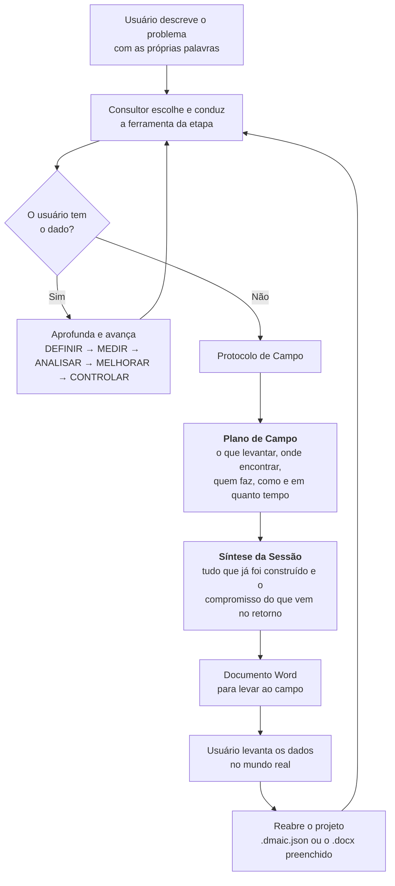

# DMAIC Agent

Consultor Six Sigma que conduz um projeto de melhoria por conversa, aplica as
ferramentas certas em cada etapa e — quando falta dado — para de perguntar e
monta o plano para você ir buscar o que falta no campo.

**Bruno Silva** · Ciência de Dados, FATEC Cotia × Outtech Services IT

## Problema

Um projeto DMAIC morre em dois lugares, e nenhum deles é falta de método.

**O formulário.** As planilhas e templates de Six Sigma pedem baseline, causa
raiz e meta quantitativa em campos vazios. Quem está começando não sabe o que
escrever ali, e quem sabe não tem os números à mão. O template não ensina a
conduzir — ele cobra o resultado de uma condução que ninguém fez.

**O dado que não existe.** No meio da análise aparece a pergunta que depende de
uma informação que ninguém levantou: quantas vezes por turno, qual o custo da
parada, quanto o cliente percebe. Aqui um LLM comum inventa um número plausível
e o projeto inteiro passa a repousar sobre ele. Em melhoria de processo, um
baseline errado com cara de certo é pior que nenhum baseline.

Este projeto ataca os dois: conduz a conversa como um Master Black Belt faria
numa reunião, uma pergunta por vez — e, ao detectar que o dado não existe, troca
a pergunta por uma tarefa de campo.

## Como funciona



O ciclo fecha: o documento que sai da aplicação é o mesmo que volta para ela.

## O Protocolo de Campo

É o que separa esta ferramenta de um chat sobre Six Sigma. O consultor
identifica sozinho que o usuário travou — disse "não sei", chutou um número,
ficou vago duas vezes seguidas — e em vez de insistir, produz três coisas e
para:

1. **Plano de Campo** — no máximo cinco itens específicos, cada um com a fonte
   concreta onde buscar, quem deve fazer, por qual método e em que prazo. Mais
   as armadilhas daquele levantamento em particular.
2. **Síntese da Sessão** — o que já se sabe, o que ainda é hipótese, e o
   compromisso explícito do que o consultor vai conduzir quando os dados
   chegarem.
3. **Documento Word** — gerado na hora, com as duas seções acima e a ficha do
   projeto, pronto para circular entre os responsáveis.

Depois disso o consultor silencia e espera o retorno. Sem esse passo o momento
de parada perde peso e a conversa volta a cobrar o dado que não existe.

## Ferramentas aplicadas

Conduzidas na conversa, não mencionadas de passagem. O consultor escolhe qual
usar — nunca pergunta ao usuário.

| Etapa | Ferramentas |
|---|---|
| **Definir** | Funil de Problemas, SIPOC, VOC, CTQ, Project Charter |
| **Medir** | Mapa de Processo, Plano de Coleta, Baseline, Pareto, MSA |
| **Analisar** | Ishikawa (6M), 5 Porquês, Matriz de Priorização, Estratificação |
| **Melhorar** | Brainstorming, Matriz Esforço × Impacto, FMEA, 5W2H |
| **Controlar** | Gráfico de Controle (CEP), Plano de Controle, SOP, Lições Aprendidas |

## Instalação

Precisa de Python 3.11+ e de uma chave de API — [Groq](https://console.groq.com/keys)
é gratuita, [OpenRouter](https://openrouter.ai/settings/keys) tem modelos
gratuitos.

```bash
git clone https://github.com/brunodt98/DMAIC-Agent.git
cd DMAIC-Agent

python -m venv .venv
source .venv/bin/activate        # Linux / macOS
.venv\Scripts\activate           # Windows

pip install -r requirements.txt
streamlit run app.py
```

Abre em `http://localhost:8501`.

## Configuração

Escolha o provedor na barra lateral e cole a chave. Ela fica só na sessão do
navegador, não é gravada em arquivo nenhum, e sobrevive a "Novo projeto" para
você não digitar de novo.

A lista de modelos é buscada no provedor no momento em que você informa a chave,
em vez de ficar escrita no código. Modelo descontinuado simplesmente deixa de
aparecer, no lugar de devolver um 404 no meio da conversa. O seletor mostra o
tamanho do contexto de cada um e marca os gratuitos.

## Usando

**Começando.** Informe empresa e responsável, descreva o problema com suas
palavras e responda as perguntas. Não precisa saber Six Sigma — a condução é do
consultor.

**Quando o Plano de Campo aparecer.** Leia o plano e a síntese, baixe o `.docx`
na barra lateral, execute o levantamento e volte com os dados. Continuar a
conversa normalmente já basta.

**Salvando e retomando.** Dois caminhos, para situações diferentes:

- **Arquivo de projeto** (`.dmaic.json`) — guarda a sessão inteira: conversa,
  dados apurados, etapa e ferramentas. É o caminho para pausar e voltar depois,
  ou para levar o projeto para outra máquina.
- **Documento Word** (`.docx`) — para quando o projeto andou fora da aplicação e
  o que existe é o documento. O consultor lê, identifica onde parou e faz um
  briefing antes de continuar.

**Recuperação após F5.** Rodando na sua máquina, a sessão é gravada em disco a
cada resposta e volta sozinha se você recarregar a página, com um aviso na barra
lateral. Os arquivos ficam em `~/.dmaic_agent`, ou no caminho de
`DMAIC_DATA_DIR`. Em acesso remoto o autosave não entra: a gravação é num
arquivo único, e num servidor compartilhado o projeto de um usuário apareceria
para o próximo — ali, salve em arquivo antes de fechar.

## Estrutura

```
app.py                  Ponto de entrada
dmaic/
├── state.py            Única ponte com o session_state do Streamlit
├── core/               Núcleo — não importa streamlit
│   ├── metodo.py       O método DMAIC como dado: etapas, ferramentas, campos
│   ├── prompt.py       System prompt do consultor
│   ├── agent.py        O que pedir ao modelo e como ler a resposta
│   ├── llm.py          Acesso aos provedores (Groq e OpenRouter)
│   ├── snapshot.py     Salvar, abrir e autosave do projeto
│   └── export/word.py  Gerador do .docx
└── ui/                 theme · header · sidebar · onboarding · chat
docs/product_spec.md    Especificação do produto
```

## Decisões de projeto

**O núcleo não conhece a interface.** Tudo em `core/` recebe estado por
parâmetro e devolve valores, sem tocar em `session_state`. É isso que permite
testar a geração do documento, a leitura da resposta e a validação de um arquivo
sem subir a aplicação.

**O consultor declara etapa e ferramentas.** Cada resposta termina num rodapé de
marcadores que a aplicação lê e remove antes de exibir. A alternativa era
procurar palavras-chave no texto, e ela falhava de um jeito específico: a frase
"precisamos medir a frequência", dita durante o DEFINIR, fazia o app pular para
MEDIR. Ferramenta agora só conta como aplicada quando o consultor diz que a
conduziu, e um salto de mais de uma etapa por resposta é contido.

**A memória do projeto não vive só no histórico.** O que já foi apurado é
reinjetado em cada chamada como bloco de estado, separado da conversa. O
histórico pode ser aparado para caber no contexto sem que o consultor esqueça o
problema que ele mesmo definiu.

**Arquivo aberto é dado não confiável.** Um `.dmaic.json` pode ter sido editado.
Campo fora da lista, etapa inexistente e ferramenta desconhecida são descartados
na leitura, e mensagem com papel diferente de `user` ou `assistant` também — o
que impede um arquivo preparado de injetar instrução de sistema na conversa.

**A gravação do autosave é atômica.** Escreve num temporário e substitui. Sem
isso, um F5 no meio da escrita deixaria um arquivo pela metade, e a sessão
seguinte não conseguiria abrir justamente o que deveria salvá-la.

## Licença

Uso acadêmico e educacional.
